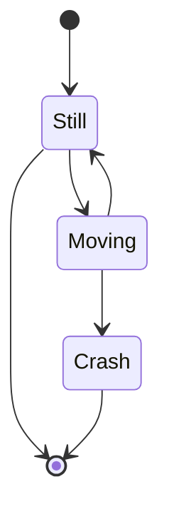

# Binary Search

Binary search is a search algorithm that works on a sorted set of elements by dividing the search universe by roughly 2 every iteration. 

```mermaid
stateDiagram
    [*] --> Still
    Still --> [*]

    Still --> Moving
    Moving --> Still
    Moving --> Crash
    Crash --> [*]

```
