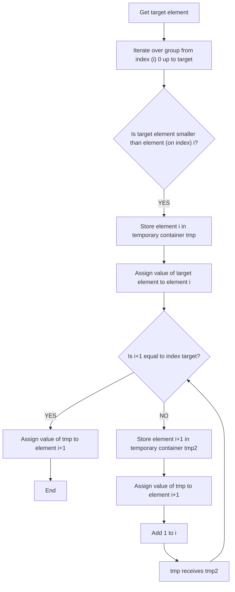

# Insertion Sort

The insertion sort algorithm consists of varioius simple comparisons between 2 elements, iterating througout the group being sorted. It uses a *current* element to make comparisons, and at the end of a comparison round, every element up to that element is sorted.

### Assumptions:

* The target group (i.e. array, list, set, etc...) has more than one element. *If not, the group is already sorted* (this can be accounted for in code)

### Steps:

